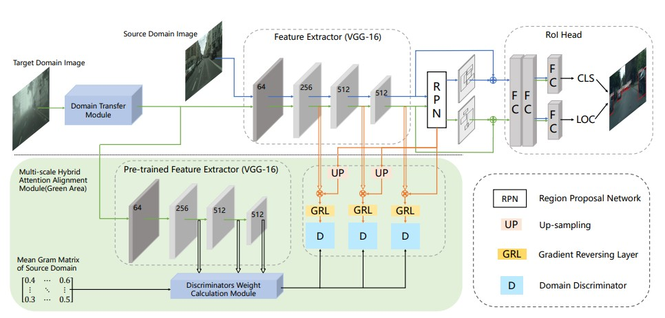
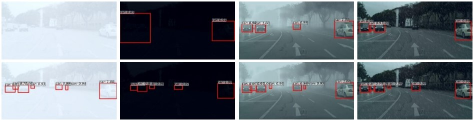
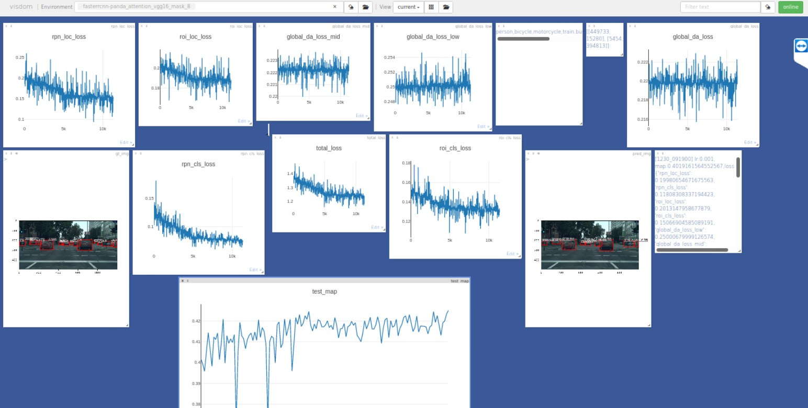

# MULTI-TARGET-DOMAIN-ADAPTATIVE-DETECTOR

## 1. Introduction
This code is based on pytorch, before training and testing, please make sure that you have at least one GPU that supports CUDA11.0 and above on your server.This project is based on the [Faster R-CNN (pytorch version)](https://github.com/chenyuntc/simple-faster-rcnn-pytorch), and the domain transfer module is based on the [Style Transfer Network](https://github.com/tyui592/Perceptual_loss_for_real_time_style_transfer). If you want to know more about the implementation of the domain transfer network, you can visit the paper [《Perceptual Losses for Real-Time Style Transfer
and Super-Resolution》](https://arxiv.org/pdf/1603.08155),The code implementation is based on Resblock, but our project provides two methods: Resblock and Denseblock. The experimental results of Resblock will perform better on 'BlenderCitySpace'. If you want to use this code to run other datasets, you can also try Denseblock.


## 2. Implementation introduction
For the consideration of training speed, this project trains the domain transfer module and Faster R-CNN separately. The domain transfer module is trained with the "BlenderCityspace" dataset. In order to minimize the negative impact of domain shift on the object detection domain adaptation task, the "FoggyCityspace" dataset is used to train Faster R-CNN.



If the domain transfer module is trained first, and then the output of the domain transfer module is used as the input of Faster R-CNN for training, it should be able to achieve better results, but it will certainly greatly extend the training time.


## 3. Dataset
To solve the problem that there is no dataset specially designed for multi-target domain adaptive object detection network, we synthesized the BlendedCityspace dataset on the basis of the two datasets “CitySpace” and “FoggyCityspace.” for
training and testing of multi-target domain adaptation. This
dataset contains six different environments: “rain”, “foggy”,
“bright”, “ultra-bright”, “dark”, and “ultra-dark”, a total of
83,016 road scenes with annotations in it.You can download this dataset from https://pan.baidu.com/share/init?surl=0E5vnjmyeRuY0KiX9LxXrw, the password is: 5hnh.

## 4. Performance
The first line of detection results under Faster R-CNN, the second line of results after adding the domain transfer module and the multi-scale hybrid attention alignment module in this article, including the environments of “ultra-bright”,“ultra-dark”, “foggy”, “rain”.



 Quantitative comparison of AP between without and with domain transform module based on Faster R-CNN trained on CitySpace (Dark* and Bright* represents the environments of “ultra-dark” and “ultra-bright” respectively).

 |           |person|bicycle|motorcycle| train |bus| truck| car| rider| mean
| :------------: | :--------: | :---------: |:---: |---: |---: |---: |---: |---: |---: |
|Hazy |25.2/25.2 |24.5/28.2| 25.6/31.0 |26.2/31.9| 25.0/24.9 |21.5/23.8 |27.2/35.7 |31.2/32.1| 25.8/29.1|
|Dark |9.0/13.0| 9.0/15.4| 9.0/13.9| 11.3/18.5| 13.4/18.5| 10.0/12.7| 23.2/32.4| 9.0/14.9| 11.8/17.4|
|Dark* |22.0/22.6| 18.4/25.2| 20.2/20.9| 31.9/38.3| 34.2/39.8| 19.3/21.8| 35.4/42.6| 23.9/29.1| 25.7/30.0|
|Bright| 24.4/30.0 |18.0/31.3| 14.2/29.5 |13.5/41.1| 30.3/47.8| 18.5/29.7| 34.1/44.5| 24.2/40.5 |22.2/36.8|
|Bright*| 14.9/24.5 |9.0/28.8| 9.0/21.4 |13.0/31.8| 14.5/36.7| 10.6/23.6| 18.0/43.2| 9.0/36.7| 12.3/30.7|
|Rain| 15.1/15.8| 13.3/15.7| 9.0/14.1| 9.0/13.0| 9.0/10.2| 9.0/7.5| 17.2/18.0| 17.0/17.0| 12.0/14.0|


## 5. Dependencies
Before running the code, please make sure the following dependencies are installed on your computer.
* Python 3.6+
* PyTorch 1.4+
* torchvision 0.6+
* visdom

## 6. Demo
If you want, you can first download our pre-trained model, which includes the pre-trained model of the domain transfer module and the pre-trained model of Faster R-CNN. The download link is: https://pan.baidu.com/s/1-wQyIyIe9b3lgPK1G20z1g, the password is: 8qt3 .

To execute the demo command:
```Bash
python demo.py
```
## 7. Train

### 7.1 Training domain transfer module

First you need to go to the "domain_transfer_network" folder, and then execute the following command

```Bash
python main.py --train-flag True --cuda-device-no 0 --imsize 1024  --train-content xxx --train-style yyy --save-path train_model_save/
```
xxx means that you need to scramble the data of the target domain in the BlenderCityspace dataset into a folder, and xxx is the location of the folder. yyy is an optional source domain image, here you may need some luck to select a suitable image, or you can directly use our pre-trained domain transfer model to directly train Faster R-CNN.

### 7.2 Training Faster R-CNN
Before training, in order to facilitate you to visualize the whole training process, please execute the following command to start visdom to observe the loss function and the change of mAP during the whole training process.The content in the BlenderCityspace dataset should go into the FoggyCityspace folder, or you can experiment directly with the FoggCityspace dataset.
```Bash
python -m visdom.server
```


Then execute the following command to train Faster R-CNN.

```Bash
python train.py train --env='env1' --plot-every=40 --caffe-pretrain=False
```

## 8. Citation
If you find this work useful in your research, please consider citing:

```
@inproceedings{Multi-Target-Domain-Adaptative-Detector,
  title={MULTI-TARGET DOMAIN TRANSFER DETECTOR ON BAD WEATHER CONDITIONS},
  author={Chonghuan Liu, Ruizhi Liu, Zhuo Su*, Fan Zhou},
  booktitle={ICME},
  year={2022}
}
```


